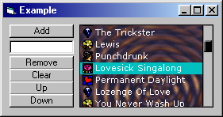



## Custom Listbox Control

### Description

This is an example that shows how to create your own kind of listbox control. This listbox does most of the stuff the normal vb listbox does, except it also lets you use a picture for the background and lets you add pictures next to items. The listbox is also done in a different style.
 
### More Info
 

             |
---                |---
**Submitted On**   |2000-08-17 13:20:02
**By**             |[Patrick Gillespie](https://github.com/Planet-Source-Code/PSCIndex/blob/master/ByAuthor/patrick-gillespie.md)
**Level**          |Advanced
**User Rating**    |4.8 (72 globes from 15 users)
**Compatibility**  |VB 6\.0
**Category**       |[Custom Controls/ Forms/  Menus](https://github.com/Planet-Source-Code/PSCIndex/blob/master/ByCategory/custom-controls-forms-menus__1-4.md)
**World**          |[Visual Basic](https://github.com/Planet-Source-Code/PSCIndex/blob/master/ByWorld/visual-basic.md)
**Archive File**   |[CODE\_UPLOAD90398172000\.zip](https://github.com/Planet-Source-Code/patrick-gillespie-custom-listbox-control__1-10741/archive/master.zip)

